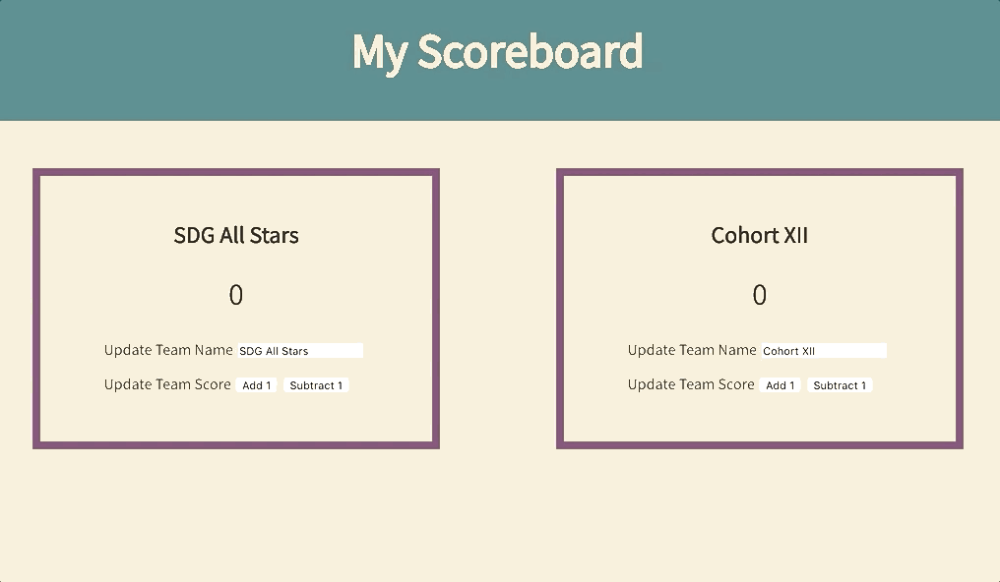

# React-Scoreboard

### See it live

https://react-scoreboard-dylanattal.surge.sh/

### Summary

This was a short project that recreated my [original Scoreboard app](http://scoreboard-dylanattal.surge.sh/) using React. This was an exciting project to make because I got to see the advantages of React very clearly.

I created the component `Team` and set their states with generic team names and initial scores of 0. I let React update the team names by setting the `input` tag's `onChange` to an `updateTeamName` function that set the state of the team name to `event.target.value`. That way, as the user types in a new name, the team name is automatically updated with each keystroke.

The "Add 1" and "Subtract 1" buttons work similarly. Each has an `onClick` function that calls `setState()` to increment or decrement the score by one.

By using the React Developer Tools in the Google Chrome browser, I could see how React only updates what it needs to on the DOM. I had read about how the virtual DOM works and how that contributes to React's speed, so it was really cool to see live!

### Project Goals

- [x] Create a scoreboard for two teams
- [x] Allow the user to change the team names
- [x] Allow the user to add points to each team's score
- [x] Allow the user to subtract points from each team's score

### Technologies Used

HTML, CSS, Javascript, React
